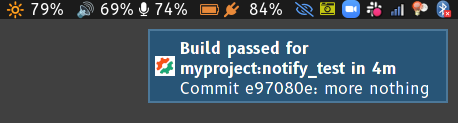
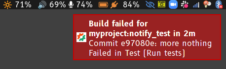

Semaphore CI notification relay
===============================

This is a service to provide Linux desktop notifications for your [Semaphore CI][semaphore] builds. Unlike Semaphore's Slack notification feature, this allows filtering to see notifications for only your own builds. It also provides DBus notifications with the Semaphore icon and a default action of opening the build results in your browser.





It's written in Go and consists of a relay server to accept [webhook notifications][sem-webhook] from Semaphore and pass them on via [WebSockets][], as well as a client that connects to the relay, subscribes to webhook messages, and sends [DBus notifications][notifications].

It uses the [Gorilla WebSocket][gorilla-ws] library, and part of the server implementation is shamelessly borrowed from its example code. DBus notifications use @esiqveland's [notify][] library.

## Server

The server provides an HTTPS service to both accept Semaphore webhook notifications to the `/hook` endpoint and accept client WebSocket connections at the `/ws` endpoint. It uses [CertMagic][] to automatically acquire a TLS certificate from [Let's Encrypt][letsencrypt]. Clients and Semaphore authenticate with shared secrets; create a password for clients to use and a token for Semaphore to use. You'll also need to set up a domain name for your server.

This has very low resource requirements; a t3.nano EC2 instance works fine and costs $3/month, and can easily be configured with a domain name via Route 53.

It's configured via environment variables:
- `DOMAIN`: DNS domain name to acquire a certificate for.
- `EMAIL`: email address used for Let's Encrypt.
- `PASSWORD`: Password used by clients.
- `TOKEN`: Security token configured in Semaphore URL.
- `TEST`: Set to send sample messages to the specified user every 15 seconds for testing.

### Running via Docker Compose

The easiest way to run the relay service is via Docker Compose, using the provided [docker-compose.yml](docker-compose.yml) and the `cswheeler/semrelay:latest` Docker image built from [Dockerfile.server](docker/Dockerfile.server). Copy `docker-compose.yml` to your server in an appropriate directory (you don't need any other files) and create a `.env` file in the same directory to set the above environment variables:

```
DOMAIN=semrelay.example.com
EMAIL=me@example.com
PASSWORD=somepassword
TOKEN=sometoken
```

Now run `docker-compose pull semrelay && docker-compose up -d semrelay`. It should acquire TLS certificates and begin listening on ports 80 and 443. It's configured to be restarted by Docker whenever it exits.

The Docker container stores its certificates in a persistent volume to avoid repeatedly generating certificates, which could run afoul of the Let's Encrypt rate limits.

### Running directly

Build the server binary with `CGO_ENABLED=0 go build ./cmd/semrelay` and copy it to the server.

To enable it to bind to ports 80 and 443 without running as root, grant it the `cap_net_bind_service` capability with `sudo setcap cap_net_bind_service=+ep semrelay`.

## Semaphore configuration

Using the token you configured the server with, set up notifications for the desired project like so:

``` shell
sem create notification myproject-relay \
    --projects myproject \
    --webhook-endpoint 'https://semrelay.example.com/hook?token=<token>'
```

## Client

The `semnotify` client can be installed with:

``` shell
go install github.com/csw/semrelay/cmd/semnotify@latest
```

Run the client with your GitHub username and the password you set on the server:

``` shell
semnotify \
    --user <username> \
    --password <password> \
    --server <hostname>
```

## Use with mako

When using this with the [mako][] notification daemon, you can configure it so notifications for the same branch will be combined. semnotify sets its application name to `Semaphore` and the category hint to `$repo/$branch`, so add the following to `.config/mako/config`:


```
[app-name=Semaphore]
group-by=category
```


[semaphore]: https://semaphoreci.com/
[sem-webhook]: https://docs.semaphoreci.com/essentials/webhook-notifications/
[websockets]: https://en.wikipedia.org/wiki/WebSocket
[gorilla-ws]: https://github.com/gorilla/websocket
[notify]: https://github.com/esiqveland/notify
[certmagic]: https://github.com/caddyserver/certmagic
[notifications]: https://wiki.archlinux.org/title/Desktop_notifications
[letsencrypt]: https://letsencrypt.org/
[mako]: https://github.com/emersion/mako
